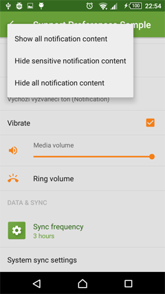

# Material Preference [  ](https://bintray.com/consp1racy/maven/net.xpece.android%3Asupport-preference/_latestVersion)


Material theme for preference widgets.

Backporting dat material look *and* functionality.

Available from API 7. Depends on preference-v7.

## How to get the library?

```groovy
dependencies {
    compile 'net.xpece.android:support-preference:0.5.6' // depends on preference-v7 r23.2.0
    /* or */
    compile 'net.xpece.android:support-preference:0.5.4' // depends on preference-v7 r23.1.1
}
```

## Screenshots

Library version 0.5.6. Android version 5.1.
Showcasing Simple Menus and custom title and summary text appearance.

&nbsp;

Library version 0.5.1. Android version 4.4.

&nbsp;
&nbsp;
&nbsp;
&nbsp;
&nbsp;
&nbsp;
&nbsp;
&nbsp;
&nbsp;

## Contents

- `Preference`
- `CheckBoxPreference`
- `SwitchPreference`
    - Using `SwitchCompat` available from API 7
- `DialogPreference`
    - Uses AppCompat AlertDialog Material theme
- `EditTextPreference`
- `ListPreference`
- `MultiSelectListPreference`
    - Available since API 7
- `SeekBarDialogPreference` extends `DialogPreference`
    - Made public
- `SeekBarPreference`
    - Made public
    - According to http://www.google.com/design/spec/components/dialogs.html#dialogs-confirmation-dialogs
- `RingtonePreference`
    - Coerced Ringtone Picker Activity from AOSP
- `XpPreferenceFragment`
    - Handles proper Preference inflation and DialogPreference dialogs
- `SharedPreferencesCompat`
    - `getStringSet` and `putStringSet` methods allow persisting string sets even before API 11

## Features on top of preference-v7

- Material preference item layouts out of the box.
- Icon and dialog icon tinting and padding.
- `EditTextPreference` understands `EditText` XML attributes.
- Several preference widgets not publicly available in preference-v7 or SDK.
    - `RingtonePreference`, `SeekBarPreference`, `SeekBarDialogPreference`, `MultiSelectListPreference`
- Subscreen navigation implementation.

## How to use the library?

### Basic setup

Your preference fragment needs to extend `XpPreferenceFragment`.

Setup your preference items in the following method:

```java
public void onCreatePreferences2(final Bundle savedInstanceState, final String rootKey) {
    // ...
}
```

Your settings activity theme needs to specify the following values:

```xml
<style name="AppTheme" parent="Theme.AppCompat.Light.NoActionBar">
    <!-- Used to theme preference list and items. -->
    <item name="preferenceTheme">@style/PreferenceThemeOverlay.Material</item>
    <!-- Default preference icon tint color. -->
    <item name="preferenceTint">@color/accent_state_list</item>
</style>
```

Styling `alertDialogTheme` is recommended for a proper color theme. See the sample project.

Sample `res/color/accent_state_list.xml`:

```xml
<selector xmlns:android="http://schemas.android.com/apk/res/android">
    <item
        android:color="@color/accent_disabled"
        android:state_enabled="false"/>
    <item android:color="@color/accent"/>
</selector>
```

Disabled alpha is 38% (#61) according to latest Material design guidelines.

### Dividers

Preference-v7 r23.2.0 provides a divider implementation out of the box.
If you want to customize how this divider looks you can call `setDivider(...)` and `setDividerHeight(...)`.
Preference-v7 divider will be drawn just between items and at the bottom of the list. It will not be drawn before the end of category.

If you want more control over where the dividers are drawn, disable the default implementation and use my own instead:

```java
@Override
public void onViewCreated(View view, Bundle savedInstanceState) {
    super.onViewCreated(view, savedInstanceState);
    getListView().addItemDecoration(new PreferenceDividerDecoration(getContext()).drawBottom(true));
    setDivider(null);
}
```

Preference-v7 r23.1.1 does not provide a default divider so you don't need to call `setDivider(null)`.

### Avoiding bugs

In appcompat-v7 r23.1.1 library there is a bug which prevents tinting of checkmarks in lists.
Call `Fixes.updateLayoutInflaterFactory(getLayoutInflater())` right after
`super.onCreate(savedInstanceState)` in your Activity.

```java
@Override
protected void onCreate(Bundle savedInstanceState) {
    super.onCreate(savedInstanceState);
    Fixes.updateLayoutInflaterFactory(getLayoutInflater());
    setContentView(R.layout.activity_settings);
    //...
}
```

This fix is not necessary or available since version 0.5.5.

### Ringtone picker

`RingtonePicker` will show only system ringtones/notification sounds by default.
If you want to include sounds from the external storage your app needs to request
`android.permission.READ_EXTERNAL_STORAGE` permission in its manifest.
Don't forget to check this runtime permission before opening ringtone picker on API 23.

### Handling PreferenceScreen icons

As `PreferenceScreen` class is final and hardwired into preference system
I was unable to automate icon tinting and padding. However you are able to do this yourself:

```java
Preference subs = findPreference("subs_screen");
PreferenceIconHelper subsHelper = new PreferenceIconHelper(subs);
subsHelper.setIconPaddingEnabled(true); // Call this BEFORE setIcon!
subsHelper.setIcon(R.drawable.some_icon);
subsHelper.setTintList(ContextCompat.getColorStateList(getPreferenceManager().getContext(), R.color.accent));
subsHelper.setIconTintEnabled(true);
```

### Subscreen navigation

One solution is implemented in `PreferenceScreenNavigationStrategy.ReplaceRoot` class.
Please review the sample project for an example solution.

### XML attributes

- `app:asp_tint`
- `app:asp_tintMode`
- `app:asp_tintEnabled`
- `app:asp_iconPaddingEnabled`
- `app:asp_dialogTint`
- `app:asp_dialogTintMode`
- `app:asp_dialogTintEnabled`
- `app:asp_dialogIconPaddingEnabled`

### Icon padding

Application icons (48dp x 48dp) require no extra padding.
For smaller icons extra padding of 4dp on each side is needed.
Achieve this by using `app:asp_iconPaddingEnabled`
and `app:asp_dialogIconPaddingEnabled` attributes. Icon padding is enabled by default.

### Proguard

Since version 0.5.1 Proguard rules are bundled with the library.

## Changelog

**0.5.6**
- *NEW!* Custom title and summary text styles.
  - `app:titleTextAppearance` and `app:titleTextColor` for titles.
  - `app:subtitleTextAppearance` and `app:subtitleTextColor` for summaries.
  - Analogous methods available in Java.
- *FIXED:* Simple menu.
  - Popup window adjusts its width according to its own content.
  - Added top and bottom padding to popup window.
  - Items can have up to two lines of text (increased form one).
  - TODO: Display current selection.

**0.5.5** *Deprecated*
- ***Only supports appcompat-v7 with preference-v7 version 23.2.0!***

**0.5.4**
- *NEW!* Simple menu variant of `ListPreference`.
  - Via `app:asp_simpleMenu="true"`.
  - Described here https://www.google.com/design/spec/components/menus.html#menus-simple-menus
  - Does not have top and bottom padding yet.
  - Menu position is unpredictable when having more than 3 menu items and the preference is first or last in the list.
  - To be updated later.
- *FIXED:* Small icon is properly aligned in RTL configurations.

**0.5.3** *Deprecated*
- *FIXED:* Ringtone picker does not *need* `READ_EXTERNAL_STORAGE` permission even prior to Android 6.

**0.5.2** *Deprecated*
- *FIXED:* `PreferenceScreenNavigationStrategy.ReplaceRoot` no longer crashes on screen rotation.
- *FIXED:* Ringtone picker does not stop playback on screen rotation.

**0.5.1** *Deprecated*
- *NEW!* `PreferenceScreenNavigationStrategy` class.
- *FIXED:* Missing Proguard rules are now bundled with the library.
- *FIXED:* Incorrect icon size on Lollipop.

**0.5.0** *Deprecated*
- ***Only supports appcompat-v7 with preference-v7 version 23.1.1!***
- *NEW!* Based on preference-v7 instead of native preferences.
- Updated appcompat-v7 library to 23.1.1.
    - Material SeekBar style across all platforms.
- `RingtonePreference` is now `DialogFragment` based.
- Unmanaged preference icons (such as that of `PreferenceScreen`) can be tinted via `PreferenceIconHelper`.
- Default preference icon tint specified by `preferenceTint` theme attribute.
- Fixed divider color.
- Sample contains `PreferenceScreen` subscreen handling.

**0.4.3**
- ***Last fully supported appcompat-v7 version is 23.0.1. After that ringtone picker crashes!***
- No more `Resources.NotFoundException` in `RingtonePickerActivity`. Falls back to English.
- Updated appcompat-v7 library to 22.2.1.

**0.4.2** *Deprecated*
- <s>`SeekBar` tinting can be turned off via `app:asp_tintSeekBar="false"`</s>
- Introduced missing `seekBarDialogPreference` style

**0.4.1** *Deprecated*
- Ringtone picker strings are now taken dynamically from `android` and `com.android.providers.media` packages, falls back to English
    - <s>These are accessible via `RingtonePickerActivity.get*String(Context)`</s>

**0.4.0** *Deprecated*
- *NEW!* Implemented SeekBarPreference according to http://www.google.com/design/spec/components/dialogs.html#dialogs-confirmation-dialogs
- *FIXED:* tinting/padding in DialogPreference and SeekBarDialogPreference
- <s>AppCompatPreferenceActivity and PreferenceFragment now implement Factory<Preference></s>
- *NEW!* app:asp_dialogIconPaddingEnabled attribute

**0.3.0** *Deprecated*
- Removed `MultiCheckPreference` as it was only partially implemented and `MultiSelectListPreference` provides the same function.
- `MultiSelectListPreference` is now available since API 7 (formerly API 11). Uses `JSONArray` to persist `Set<String>`.
- API for persisting and accessing string sets since API 7 is available via `SharedPreferencesCompat`.
- `Preference`s now support `app:asp_iconPaddingEnabled` attribute which allows to better align non-launcher icons to 16dp keyline.
- <s>Custom preferences are now recycled which fixed animation issues on Lollipop.</s>
- Custom preferences are now always inflated on all platforms if using `AppCompatPreferenceActivity` and/or custom `PreferenceFragment`.
- Library no longer includes `android.permission.READ_EXTERNAL_STORAGE` permission (used to read ringtones). You have to do it yourself.
    - This is needed because the custom picker is part of the app and not provided by system.
    - <s>You are of course free to use `android.preference.RingtonePreference` when necessary.</s>

**0.2.2** *Deprecated*
- optional tinting <s>via `app:asp_tintIcon="true"` and `app:asp_tintDialogIcon="true"` and `asp_tint` and `asp_tintMode`</s>.

**0.2.1** *Deprecated*
- No need for `net.xpece.android.support.preference.` prefix in XML files defining preferences, framework will choose automatically:
    - <s>On Lollipop native `Preference`, `CheckBoxPreference`, `SwitchPreference` will be used.</s>
    - <s>Otherwise support version will be used.</s>
    - <s>Force either version by using fully qualified class name.</s>
    - <s>You need to use `AppCompatPreferenceActivity` or special `PreferenceFragment` both of which are provided.</s>
- <s>Added `PreferenceCompat#setChecked(Preference, boolean)` helper method.</s>

**0.1.2** *Deprecated*
- Czech strings
- `SeekBar` in `SeekBarDialogActivity` uses `ColorFilter` to match theme

**0.1.1** *Deprecated*
- Initial release
- Backported material style and icon capability for `Preference` children
- Backported `SwitchPreference`
- Material styled `RingtonePreference` picker dialog/activity

## Known issues

- SwitchPreference does not animate its SwitchCompat widget when clicked.
    - https://code.google.com/p/android/issues/detail?id=196652
- MultiSelectListPreference items may be incorrectly tinted on Android 2.
- SeekBarPreference's SeekBar may appear in disabled state until clicked on Android 2.

## Questions

- Why are some of your classes in `android.support.v7` packages?
    - I'm using their package private features to achieve consistent results.

## Credit

Most of this library is straight up pillaged latest SDK mixed with heavy reliance on appcompat-v7. Since version 0.5.0 the same applies to preference-v7. Kudos to the people who create and maintain these!
