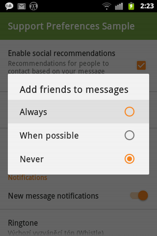
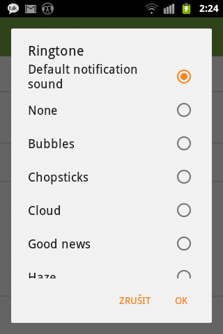
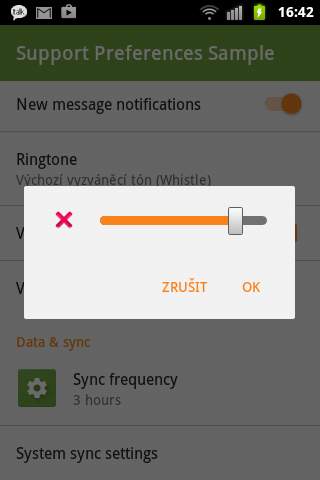

# Material Preference

Material themes for preference widgets and support preference widgets.

Available from API 7. Depends on appcompat-v7-r22.1.1.

## Screenshots

All taken from a API 10 device.

&nbsp;
&nbsp;
&nbsp;
&nbsp;
&nbsp;


## Contents

- `Preference`
  - Material theme
  - Icon capability from API 7

- `TwoStatePreference` extends `Preference`
  - Base for checkable preferences, now made public

- `CheckBoxPreference` extends `TwoStatePreference`

- `SwitchPreference` extends `TwoStatePreference`
  - Using `SwitchCompat` available from API 7

- `DialogPreference` extends `Preference`
  - Base for preferences modified via a dialog
  - Uses AppCompat Alert Dialog Material theme

- `EditTextPreference` extends `DialogPreference`

- `ListPreference` extends `DialogPreference`

- `MultiCheckPreference` extends `DialogPreference`

- `RingtonePreference` extends `Preference`
  - Extracted Ringtone Picker Activity from AOSP
  - Customizable AppCompat theme

- `SeekBarDialogPreference` extends `DialogPreference`

## How to get the library?

```groovy
repositories {
    maven { url "http://dl.bintray.com/consp1racy/maven" }
}

dependencies {
    compile 'net.xpece.android:support-preference:0.1.2'
}
```

## How to use the library?

For now: Please read known issues at the bottom of this page and carefully examine the sample project.

## Changelog

**0.1.2**
- Czech strings
- `SeekBar` in `SeekBarDialogActivity` uses `ColorFilter` to match theme

**0.1.1**
- Initial release
- Backported material style and icon capability for `Preference` children
- Backported `SwitchPreference`
- Material styled `RingtonePreference` picker dialog/activity
- Some hidden preferences made public

## Work TBD

- Try unifying view IDs inside layouts so they can be used interchangeably with native and custom preferences
  - This would make custom `Preference` and `CheckBoxPreference` obsolete if you target at least API 14.
- Steal `PreferenceInflater` from SDK so we don't need to duplicate preference XML files in `res/xml-v21`.

## Known issues

- Doesn't work well with fragment headers. Use simple preference layout as much as possible.
- Multilingual strings for Ringtone picker activity are not pulled yet.
- `CheckBoxPreference` and `SwitchPreference` don't animate on Lollipop. Use native counterparts.
- `SeekBarDialogPreference` has no Material style for `SeekBar` yet.

- Use this method to handle checkbox preferences until it's released:
```java
  @TargetApi(Build.VERSION_CODES.ICE_CREAM_SANDWICH)
  public static void setChecked(Preference preference, boolean checked) {
      if (preference instanceof net.xpece.android.support.preference.TwoStatePreference) {
          ((net.xpece.android.support.preference.TwoStatePreference) preference).setChecked(checked);
      } else if (preference instanceof android.preference.CheckBoxPreference) {
          ((android.preference.CheckBoxPreference) preference).setChecked(checked);
      } else if (Build.VERSION.SDK_INT >= Build.VERSION_CODES.ICE_CREAM_SANDWICH
          && preference instanceof android.preference.TwoStatePreference) {
          ((android.preference.TwoStatePreference) preference).setChecked(checked);
      } else {
          Timber.e("#setChecked called on non-checkable preference!");
      }
  }
```
- If you want Holo seek bar on Gingerbread, copy necessary resources from SDK to your project and override `android:seekBarStyle` in your theme appropriately.
