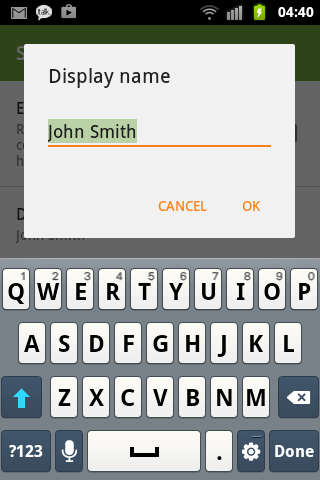
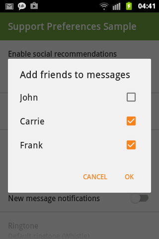

# Material Preference


Material theme for preference widgets.

Backporting dat material look *and* functionality.

Available from API 7. Depends on appcompat-v7-r22.1.1.

## Screenshots

All taken from an API 10 device.

&nbsp;
&nbsp;
&nbsp;
&nbsp;
&nbsp;
&nbsp;
&nbsp;


## Contents

- `Preference`
- `CheckBoxPreference`
- `SwitchPreference`
    - Using `SwitchCompat` available from API 7
- `DialogPreference`
    - Uses AppCompat Alert Dialog Material theme
- `EditTextPreference` extends `DialogPreference`
- `ListPreference` extends `DialogPreference`
- `MultiSelectListPreference` extends `DialogPreference`
    - Now available from API 7
- `SeekBarDialogPreference` extends `DialogPreference`
    - Made public, appropriately tinted `SeekBar`
- `SeekBarPreference`
    - Made public, appropriately tinted `Seekbar`
    - According to http://www.google.com/design/spec/components/dialogs.html#dialogs-confirmation-dialogs
- `RingtonePreference`
    - Extracted Ringtone Picker Activity from AOSP
    - Customizable AppCompat theme
- `AppCompatPreferenceActivity`
    - Combines `PreferenceActivity` with appcompat-v7 theme and custom `PreferenceInflater`
-  `PreferenceFragment`
    - Combines `android.preference.PreferenceFragment` with custom `PreferenceInflater`
- `SharedPreferencesCompat`
    - `getStringSet` and `putStringSet` methods allow persisting string sets even before API 11

## How to get the library?

```groovy
dependencies {
    compile 'net.xpece.android:support-preference:0.4.2'
}
```

## How to use the library?

For now: Please read known issues at the bottom of this page and carefully examine the sample project.

Your preference activity or preference fragment should extend `AppCompatPreferenceActivity` or custom `PreferenceFragment` respectively.

The theme used by this activity must include the following attributes:

```xml
<item name="android:preferenceCategoryStyle">@style/Preference.Material.Category</item>
<item name="android:preferenceInformationStyle">@style/Preference.Material.Information</item>
<item name="android:preferenceScreenStyle">@style/Preference.Material.PreferenceScreen</item>

<item name="preferenceStyle">@style/Preference.Material</item>
<item name="checkBoxPreferenceStyle">@style/Preference.Material.CheckBoxPreference</item>
<item name="dialogPreferenceStyle">@style/Preference.Material.DialogPreference</item>
<item name="editTextPreferenceStyle">@style/Preference.Material.DialogPreference.EditTextPreference</item>
<item name="ringtonePreferenceStyle">@style/Preference.Material.RingtonePreference</item>
<item name="switchPreferenceStyle">@style/Preference.Material.SwitchPreference</item>
<item name="seekBarPreferenceStyle">@style/Preference.Material.SeekBarPreference</item>
<item name="seekBarDialogPreferenceStyle">@style/Preference.Material.DialogPreference.SeekBarDialogPreference</item>

<item name="asp_textAppearanceListItemSecondary">@style/TextAppearance.AppCompat.Body1</item>
```

If that's too verbose the theme may extend one of

- `Theme.AppCompat.Preference`
- `Theme.AppCompat.Light.Preference`
- `Theme.AppCompat.Light.DarkActionBar.Preference`

which you should customize further at least like so:

```xml
<style name="AppTheme.Preference" parent="Theme.AppCompat.Light.DarkActionBar.Preference">
    <item name="colorPrimary">@color/primary</item>
    <item name="colorPrimaryDark">@color/primary_dark</item>
    <item name="colorAccent">@color/accent</item>

    <item name="android:textColorHighlight">@color/text_highlight</item>

    <item name="alertDialogTheme">@style/AppTheme.Dialog.Alert</item>
</style>

<style name="AppTheme.Dialog.Alert" parent="Theme.AppCompat.Light.Dialog.Alert">
    <item name="colorPrimary">@color/primary</item>
    <item name="colorPrimaryDark">@color/primary_dark</item>
    <item name="colorAccent">@color/accent</item>

    <item name="android:textColorHighlight">@color/text_highlight</item>
</style>
```

If you'll be using custom `RingtonePreference` your app needs to request the `android.permission.READ_EXTERNAL_STORAGE` permission in its manifest. If for some reason you cannot do this, use `android.preference.RingtonePreference` which will use the system dialog.

If you won't be extending `AppCompatPreferenceActivity`, you'll need to specify all preferences in XML by their fully qualified class name.

## Changelog

**0.4.2**
- `SeekBar` tinting can be turned off via `app:asp_tintSeekBar="false"`
- Introduced missing `seekBarDialogPreference` style

**0.4.1**
- Ringtone picker strings are now taken dynamically from `android` and `com.android.providers.media` packages, falls back to English
    - These are accessible via `RingtonePickerActivity.get*String(Context)`

**0.4.0**
- *NEW!* Implemented SeekBarPreference according to http://www.google.com/design/spec/components/dialogs.html#dialogs-confirmation-dialogs
- *FIXED:* tinting/padding in DialogPreference and SeekBarDialogPreference
- AppCompatPreferenceActivity and PreferenceFragment now implement Factory<Preference>
- *NEW!* app:asp_dialogIconPaddingEnabled attribute

**0.3.0**
- Removed `MultiCheckPreference` as it was only partially implemented and `MultiSelectListPreference` provides the same function.
- `MultiSelectListPreference` is now available since API 7 (formerly API 11). Uses `JSONArray` to persist `Set<String>`.
- API for persisting and accessing string sets since API 7 is available via `SharedPreferencesCompat`.
- `Preference`s now support `app:asp_iconPaddingEnabled` attribute which allows to better align non-launcher icons to 16dp keyline.
- Custom preferences are now recycled which fixed animation issues on Lollipop.
- Custom preferences are now always inflated on all platforms if using `AppCompatPreferenceActivity` and/or custom `PreferenceFragment`.
- Library no longer includes `android.permission.READ_EXTERNAL_STORAGE` permission (used to read ringtones). You have to do it yourself.
    - This is needed because the custom picker is part of the app and not provided by system.
    - You are of course free to use `android.preference.RingtonePreference` when necessary.

**0.2.2**
- optional tinting via `app:asp_tintIcon="true"` and `app:asp_tintDialogIcon="true"` and `asp_tint` and `asp_tintMode`.

**0.2.1**
- No need for `net.xpece.android.support.preference.` prefix in XML files defining preferences, framework will choose automatically:
    - <s>On Lollipop native `Preference`, `CheckBoxPreference`, `SwitchPreference` will be used.</s>
    - <s>Otherwise support version will be used.</s>
    - <s>Force either version by using fully qualified class name.</s>
    - You need to use `AppCompatPreferenceActivity` or special `PreferenceFragment` both of which are provided.
- <s>Added `PreferenceCompat#setChecked(Preference, boolean)` helper method.</s>

**0.1.2**
- Czech strings
- `SeekBar` in `SeekBarDialogActivity` uses `ColorFilter` to match theme

**0.1.1**
- Initial release
- Backported material style and icon capability for `Preference` children
- Backported `SwitchPreference`
- Material styled `RingtonePreference` picker dialog/activity

## Work TBD
- Look into styling multi-pane header preferences

## Known issues

- Doesn't work well with fragment headers. Use simple preference layout as much as possible.
- Multilingual strings for Ringtone picker activity are not pulled yet.

If you want Holo seek bar on Gingerbread, copy necessary resources from SDK to your project, define
custom `Widget.Something.SeekBar` style and override `android:seekBarStyle` in your theme appropriately.
